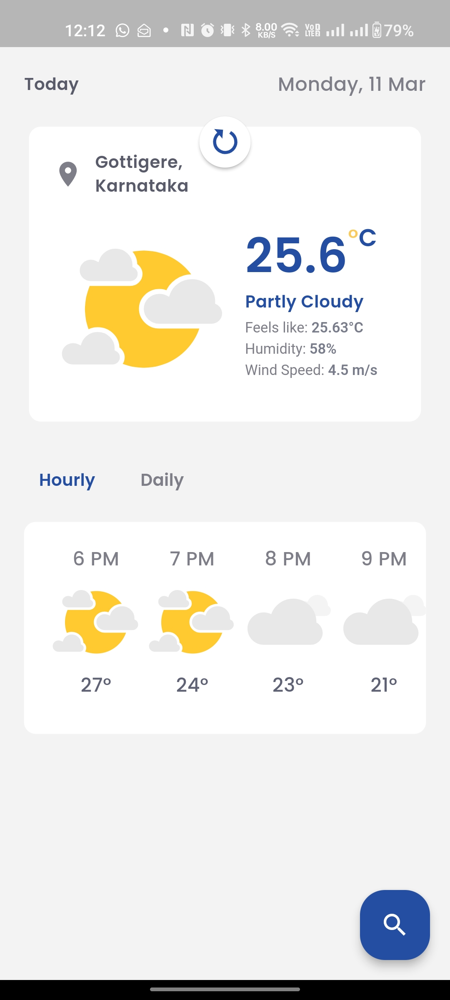

Tomorrow Weather
Tomorrow Weather is a Flutter-based weather application that uses the Tomorrow.io weather APIs to provide weather forecasts. This application is compatible with both Android and iOS platforms.

## Screenshots




Features
Current weather conditions
Hourly and weekly forecasts
Location-based weather updates

To run this project, you need to have Flutter and Dart installed on your system. If you haven't installed them yet, you can follow the instructions on the Flutter website.

## Configuration

Before you can run the application, you need to configure the API key.

1. Open the file [lib/core/utils/constants.dart](lib/core/utils/constants.dart).
2. Locate the `kApiKey` constant.
3. Replace the `kApiKey` constant with your Tomorrow.io API key.

Please ensure that you do not commit your API key to a public repository.

## Code Generation

This project uses `build_runner` and `easy_localization` for code generation. To generate the necessary code, run the following commands:

1. For `build_runner`, run:
   ```bash
   flutter pub run build_runner watch --delete-conflicting-outputs
   ```
2. For `easy_localization`, run:
   ```bash
   flutter pub run easy_localization:generate --source-dir ./assets/locales -f keys -O lib/gen -o locale_keys.g.dart
   ```

Please ensure to run these commands every time you make changes to the files that need code generation.

## Dependencies

This project relies on several major libraries to function properly:

- `Dio`: A powerful HTTP client for Dart, which supports Interceptors, Global configuration, FormData, Request Cancellation, File downloading, Timeout, etc.
- `Retrofit`: A type-safe HTTP client for Dart and Flutter, inspired by Retrofit for Android.
- `RxDart`: Provides additional functionality on top of the Dart Streams API for asynchronous programming.
- `Easy Localization`: Simplifies the internationalization process in Flutter.
- `Geocoding`: Provides geocoding and reverse geocoding of addresses.
- `Permission Handler`: A permissions plugin for Flutter which can manage app permissions.
- `Flutter ScreenUtil`: A Flutter plugin for adapting screen and font size, allowing your UI to display properly on different screen sizes.
- `Geolocator`: A Flutter geolocation plugin which provides easy access to platform-specific location services.
- `Fluttertoast`: A plugin to show short message notifications to the user.
- `Dartz`: A library for functional programming in Dart.
- `Flutter Bloc`: A predictable state management library that helps implement the BLoC design pattern.
- `Equatable`: A Dart package that helps to implement value-based equality without needing to explicitly override == and hashCode.
- `Get It`: A simple service locator for managing state and dependencies.

## Architecture

This project follows the principles of Clean Architecture, which is an architectural approach that separates the software into concentric layers with a strong emphasis on separation of concerns and scalability. The main components of this architecture in the project are:

- `Entities`: These are the business objects of the application.
- `Use Cases`: These are the business rules of the application. Each use case is a set of actions that can be executed.
- `Repositories`: These are interfaces that represent the data layer and are implemented in the data layer.
- `Data Sources`: These are the actual data providers, such as network requests, database access, etc.
- `Presentation Layer (Bloc)`: This is where the UI components and user interactions are handled.

The Clean Architecture allows the separation of code in a way that makes it easier to test and maintain. It also ensures that the application is not dependent on any external agency.

## Running the Project
Once you have Flutter and Dart set up, you can run the project using the following steps:

1. Clone the repository to your local machine.
2. Navigate to the project directory in your terminal.
3. Run `flutter pub get` to fetch the project dependencies.
4. Start your emulator or connect your device with USB debugging enabled.
5. Run `flutter run` to start the application.
   Contributing
   Contributions are welcome! Please read our contributing guidelines to get started.

License
This project is licensed under the terms of the MIT license. See the LICENSE file for details.
